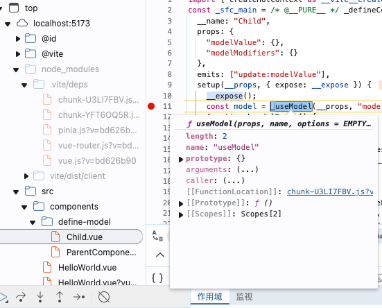

# 如何debug查看vue源码
- 更多工具->开发人员工具里（chrome在右上角，edge在左下脚），需要将 Enable JavaScript source maps 给取消勾选了，不然在debug源码的时候断点就会走到vue文件中，而不是走到编译会的js文件中。

- 需要在设置里面的Ignore List看看node_modules文件夹是否被忽略。新版谷歌浏览器中会默认排除掉node_modules文件夹，所以我们需要将这个取消勾选。如果忽略了node_modules文件夹，那么debug的时候断点就不会走到node_modules中vue的源码中去了。

- 设置断点，查看三方源码

