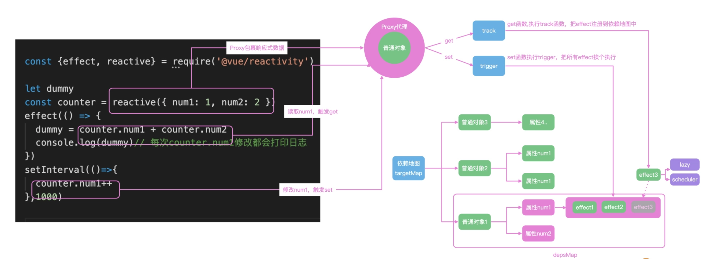

# reactive 
Vue.js 3 提供了两个重要的响应式 API，reactive 和 ref，他们都可以生成响应式数据，
而且 ref 可以接收基础类型和对象类型数据，但是 reactive 只能接收对象类型数据。
在 Vue3 中，reactive 是通过 ES6 中的 Proxy 特性实现的属性拦截.
## reactive() API 有两条限制：

仅对对象类型有效（对象、数组和 Map、Set 这样的集合类型），而对 string、number 和 boolean 这样的 原始类型 无效。

因为 Vue 的响应式系统是通过 property 访问进行追踪的，因此我们必须始终保持对该响应式对象的相同引用。
这意味着我们不可以随意地“替换”一个响应式对象，因为这将导致对初始引用的响应性连接丢失：
```
let state = reactive({ count: 0 })

// 上面的引用 ({ count: 0 }) 将不再被追踪（响应性连接已丢失！）
state = reactive({ count: 1 })
```
如果确实要去除响应式，可以使用toRaw，把响应式的关系解除。

## demo
一个最简单的响应式模型，我们可以通过 reactive 或者 ref 函数，把数据包裹成响应式对象，
并且通过 effect 函数注册回调函数，然后在数据修改之后，响应式地通知 effect 去执行回调函数即可。
具体见 ReactiveButton.vue 、DeepReactive.vue 

### 响应式原理



在 effect 中获取 counter.num1 和 counter.num2 的时候，就会触发 counter 的 get 拦截函数；get 函数，会把当前的 effect 函数注册到一个全局的依赖地图中去。这样 counter.num1 在修改的时候，就会触发 set 拦截函数，去依赖地图中找到注册的 effect 函数，然后执行。

reactive 是通过 ES6 中的 Proxy 特性实现的属性拦截.

## 注意点
响应式数据解构或者属性赋值后，可能会丢失响应式联系
```
<template>
  <textarea v-model="text" placeholder="文本信息" />
  <div>文本信息：{{text}}</div>
</template>

<script setup>
import { reactive } from 'vue';
const state = reactive({
  text: '今天是2022年01月01日',
});
const { text } = state;
</script>
```
上述代码中，text 的响应式联系并不会生效。

第二个注意点就是“慎用浅层响应式作用 API”，例如 shallowReactive 和 shallowReadonly。为什么呢？
因为 shallowReactive 这类响应式 API 生成的响应式对象数据，只作用对象数据的下一级属性，
至于对象的下下一级属性就作用不到了。

为什么 ref 需要返回一个 RefImpl 类型，而不是直接返回 Proxy 类型呢？这是因为 Proxy 只能代理监听对象类型的数据，
例如 JSON 和 Array 数据，但是监听不了单纯的基础类型数据，例如 Number、String 之类。
这个时候我们就需要设置一个 value 属性的对象来处理对基础类型数据的代理监听操作。

这也是为什么reactive没有value属性的原因，因为其只作用于对象。

<br>

## Vue3 VS Vue2
- 相比于 Vue2 使用的 Object.defineProperty，Vue3 不需要提前递归收集依赖，初始化的速度更快；
- Vue2 收集依赖的过程中会产生很多的 Dep 对象，Vue3 可以节省这部分的内存开销；
- Vue2 无法监听数组、对象的动态添加、删除，需要通过 $set、$delete，增加学习成本；
- Vue2 无法监听 Set、Map，只能处理普通对象。

## 为什么在template里使用ref包裹的变量不需要.value
```vue
<template>
  <p>{{ msg }}</p>
  <button @click="msg = 'Hello Vue3'">change msg</button>
</template>

<script setup lang="ts">
import { ref } from "vue";

const msg = ref("Hello World");

console.log(msg.value);
</script>
```
msg被ref包裹，在js里需要.value, 但是在template里不需要。

在template中使用ref变量无需使用.value，是因为在Proxy的get拦截中已经帮我们自动处理了.value。

```ts
const shallowUnwrapHandlers = {
  get: (target, key, receiver) => unref(Reflect.get(target, key, receiver)),
  set: (target, key, value, receiver) => {
    const oldValue = target[key];
    if (isRef(oldValue) && !isRef(value)) {
      oldValue.value = value;
      return true;
    } else {
      return Reflect.set(target, key, value, receiver);
    }
  },
};
```
- Reflect.get(target, key, receiver)的作用是获取target对象的key属性，在我们这里就是获取setup返回值对象的msg属性，也就是我们定义的msg变量。并且这个msg变量是一个ref。
- 将Reflect.get方法拿到的msg变量传给unref函数，这个unref函数同样是暴露出来的一个API。如果参数是 ref，则返回内部值，否则返回参数本身。这是 val = isRef(val) ? val.value : val 计算的一个语法糖。
- 经过unref函数的处理后，在get拦截中return的就是.value后的内容，也就是msg.value。