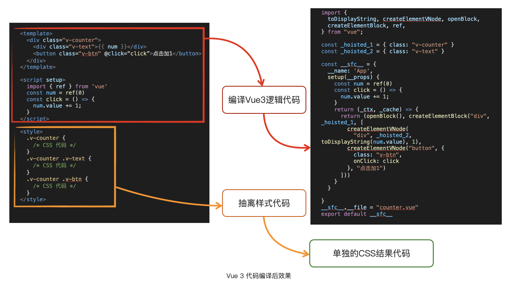

# Compilation mechanism
Vue.js 经过编译后产出是 JavaScript 和 CSS 代码，也就是浏览可以直接支持运行的代码。

这个最终结果可以直接在支持 ES Modules 的浏览器环境运行，还可以将其再次经过 ES6+ 语法的编译(比如使用bebal降级)，
最后成为能在浏览器直接运行的 ES5 代码。

这个编译后的结果，也就是最原始的 Vue.js 非编译模式的运行方式，也是我们最常用的模式。

 

## Vue.js 非编译模式是如何运行的？
1. 使用h函数，见 h.html

2. 使用createElementVNode，不推荐，比使用h复杂。

3. 使用模版的非编译模式, 见tmp.html

那么这个编译过程会在哪进行呢？答案就是在浏览器里进行编译。
由于是直接写模板代码，代码运行的时候有一个模板的编译过程，也就是会将字符串模板编译成 VNode 的结果，再执行 VNode 的渲染。
对比 h函数 和直接的 VNode 的运行过程多了编译操作，同时使用的运行时也增加了编译代码。

Vue.js 的非编译模式直接可以书写出在浏览器运行的 Vue.js 代码，意味着我们可以跳过开发编译阶段，
直接在浏览器里组装 Vue.js 的代码结构，动态渲染出想要页面功能。

这个模式适用于一切能在浏览器动态搭建的场景，比如低代码搭建页面的场景。
换句话说，Vue.js 的非编译写法可以直接用于低代码的核心解决方案中。

比如，基于非编译的写法可以用来编写低代码平台搭建页面的组件运行时，
阿里等大厂内部的基于 React.js 的低代码场景实现方式，也经常见到基于 React.js 的非编译写法来构造浏览器端的运行时。